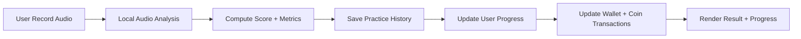
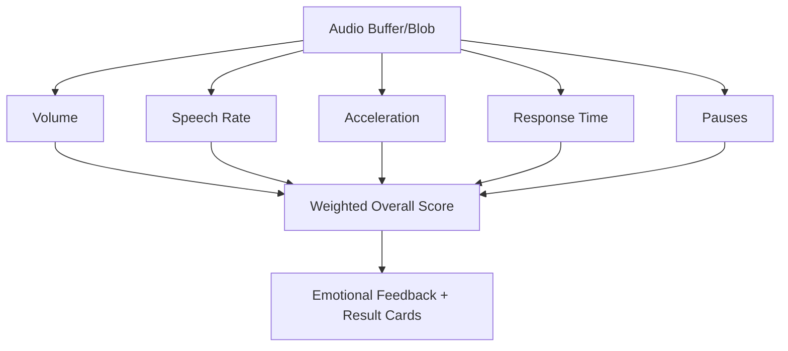

# Chunks Economy Refactor

> Nền tảng luyện nói tiếng Anh với chấm điểm phát âm/fluency, tracking tiến độ và coin economy (React + Vite + Supabase).

## 1) Tổng quan

`chunks-economy-refactor` là bản refactor của hệ thống học/luyện nói, tập trung vào:
- **Practice flow ổn định hơn** (record → analyze → lưu DB → hiển thị kết quả)
- **Scoring/metrics có thể cấu hình** từ admin
- **Coin economy + progress tracking** đầy đủ theo bài học/category/item
- **Tái sử dụng logic audio analysis** theo hướng đồng bộ với repo chuẩn nội bộ

---

## 2) Tech Stack

- **Frontend:** React 18, TypeScript, Vite
- **UI:** TailwindCSS, shadcn-ui, Framer Motion, Lucide
- **Data/Auth:** Supabase (Postgres + Auth + Edge Functions)
- **Speech/AI:** Deepgram (qua Supabase Edge Function)

---

## 3) Chức năng chính

### Learner
- Đăng nhập / phân quyền route
- Xem khóa học + lesson
- Practice theo từng item (record audio, chấm điểm, feedback)
- Xem tiến độ theo lesson/category
- Nhận / trừ coin theo score + bonus logic
- Xem lịch sử giao dịch coin và leaderboard

### Admin
- Quản lý người dùng
- Quản lý cấu hình coin economy
- Cấu hình scoring metrics/weights
- Theo dõi dữ liệu học tập

---

## 4) Luồng nghiệp vụ cốt lõi



### Audio Analysis Flow



---

## 5) Cấu trúc thư mục quan trọng

- `src/pages/` — các trang chính (`Practice`, `Progress`, `Admin`, `Profile`, ...)
- `src/components/practice/` — UI practice, result, waveform, modal
- `src/components/admin/` — panel cấu hình admin (metrics, coin, user)
- `src/hooks/` — data hooks (practice, wallet, coin config, ...)
- `src/lib/audioAnalysis.ts` — core audio scoring logic
- `src/integrations/supabase/` — client + generated DB types
- `supabase/functions/` — edge functions:
  - `analyze-speech`
  - `deepgram-transcribe`
  - `practice-ingest`

---

## 6) Cài đặt nhanh

## 6.1 Yêu cầu
- Node.js 18+
- npm 9+
- Supabase project

## 6.2 Setup

```bash
npm install
cp .env.example .env
```

Điền biến môi trường trong `.env`:
- `VITE_SUPABASE_URL`
- `VITE_SUPABASE_PUBLISHABLE_KEY`
- `VITE_SUPABASE_PROJECT_ID`

## 6.3 Chạy local

```bash
npm run dev
```

---

## 7) Supabase setup

1. Tạo project Supabase mới.
2. Cập nhật `project_id` trong `supabase/config.toml`.
3. Push schema/migrations:

```bash
npx supabase db push --project-ref <SUPABASE_PROJECT_REF> --schema public
```

4. Deploy edge functions:

```bash
npx supabase functions deploy analyze-speech --project-ref <SUPABASE_PROJECT_REF>
npx supabase functions deploy deepgram-transcribe --project-ref <SUPABASE_PROJECT_REF>
npx supabase functions deploy practice-ingest --project-ref <SUPABASE_PROJECT_REF>
```

5. Setup Deepgram theo: [DEEPGRAM_SETUP.md](./DEEPGRAM_SETUP.md)

---

## 8) Scripts

- `npm run dev` — chạy dev server
- `npm run build` — build production
- `npm run lint` — lint source
- `npm run preview` — preview bản build

---

## 9) Data model (tracking)

Các bảng quan trọng:
- `practice_history` — lưu mỗi lần practice (score, metrics, coins)
- `user_progress` — tiến độ theo lesson/category/item
- `user_wallets` — số dư coin, tổng earn/spend
- `coin_transactions` — lịch sử cộng/trừ coin
- `coin_config` — cấu hình reward/penalty/milestone/streak

---

## 10) Troubleshooting nhanh

### Không lưu progress / coin
- Check `.env` Supabase đúng project
- Check RLS policy cho `practice_history`, `user_progress`, `user_wallets`, `coin_transactions`
- Mở browser console kiểm tra lỗi 4xx/5xx của Supabase
- Đảm bảo giá trị score/coins/metrics không bị `NaN`

### Analyze audio xong nhưng không có kết quả
- Kiểm tra quyền microphone
- Kiểm tra edge function `deepgram-transcribe` đã deploy + secret đúng
- Kiểm tra payload audio blob/base64 hợp lệ

### Build warning chunk lớn
- Đây là warning tối ưu bundle, không phải lỗi runtime.

---

## 11) Tài liệu liên quan

- [SOUL.md](./SOUL.md) — product principles
- [DEEPGRAM_SETUP.md](./DEEPGRAM_SETUP.md) — cấu hình transcription

---

## 12) Ghi chú phát triển

- Routes chính ở `src/App.tsx`
- Auth context ở `src/context/AuthContext.tsx`
- Nên giữ audio analysis và metrics schema nhất quán giữa UI + hooks + DB để tránh lỗi runtime/save.
